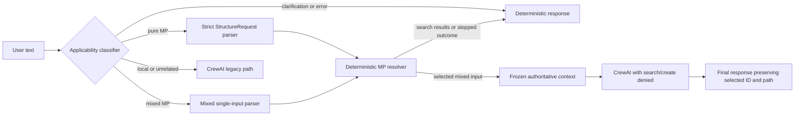

# Deterministic Materials Project structure retrieval

## Problem and objective

The original structure-search path exposed Materials Project search and structure
creation tools directly to CrewAI. In a 20-run baseline, the search tool was called
in only 16 runs; some runs delegated or searched repeatedly, and some successful
retrievals were reported as failures. Candidate choice could therefore depend on
agent behavior and prose rather than a reproducible scientific policy.

The replacement keeps natural-language interaction but moves scientific candidate
filtering, equivalence grouping, ranking, and selection into versioned Python code.
Natural-language interpretation still uses an LLM. Scientific filtering and
candidate selection do not.

## Execution architecture

Before:

```text
user text -> CrewAI planning -> MP search/structure creation tools -> LLM choice
```

The active Quart path now uses:



Flask is not integrated with this boundary. The legacy MCP
`search_materials_project` implementation and global YAML tool lists are unchanged.

## Parsing boundary and request contract

The applicability classifier distinguishes pure retrieval, a mixed workflow needing
an MP structure, local/unrelated work, clarification, and classification failure.
Its evidence must quote the source text. Explicit retrieval intent that cannot be
grounded as a formula, chemical system, or MP ID stops for clarification instead of
falling through to structure creation.

The strict `StructureRequest` supports:

- search or single selection;
- `return_all`, `require_unique`, or `most_stable` behavior;
- one or more MP IDs, formula, chemical system, and included/excluded elements;
- explicit crystal system, space-group symbol/number, site-count range, and
  energy-above-hull range;
- explicit stable and theoretical/experimental filters;
- semantic labels, result limits, and deterministic ordering.

The LLM may extract only constraints stated by the user. It may not infer space
group, crystal system, site count, energy bounds, MP IDs, or theoretical policy from
a phase name. In mixed single-input mode, the application owns
`operation=select` and defaults to `selection=require_unique`; explicit “most
stable” changes the selection policy. Requests requiring multiple initial
structures stop for clarification in this phase.

Examples:

| Prompt | Parsed intent/outcome |
|---|---|
| `search for MoS2 structures` | search and deterministically ordered results |
| `get the most stable MoS2 structure` | select using finite hull energy |
| `get an MoS2 structure` | require uniqueness; ambiguity is possible |
| `retrieve mp-2815` | validate and retrieve exactly that record |
| `relax 2H-WS2 using VASP` | mixed, one 2H WS2 input required |
| `get the structure of water` | clarification: molecule versus crystalline phase |
| `calculate bands from vasprun.xml` | local/unrelated pass-through |

Common chemical names are not automatically translated to formulas. A request such
as `get the structure of sodium chloride` may therefore require a formula or MP ID.

## Deterministic resolver

The resolver uses `deprecated=False` and the version-one policy
`include_gnome=False`. It requests a deliberate `SummaryDoc` field list and uses
`num_chunks=None` with a fixed chunk size so all matching pages are consumed. API
ordering is ignored.

Each record is revalidated locally against every explicit request constraint.
Formula and chemical-system values are normalized with pymatgen. Symmetry is
recomputed from the returned structure. Non-finite energy values become missing
values; malformed records are rejected without discarding valid records.

Search results are fully retrieved, validated, and sorted before `result_limit` is
applied. Search writes no structure files. The default order is finite
`energy_above_hull`, followed by missing energies, with canonical numeric MP ID as
the final tie-breaker.

For single selection, `StructureMatcher` groups structurally equivalent records.
An MP-ID tie-breaker chooses only a representative within an equivalent group; it
never selects between scientifically distinct groups. `require_unique` selects only
when one structural group remains. `most_stable` ranks groups by their minimum
finite hull energy, returns insufficient data if every group lacks energy, and
returns ambiguity when distinct groups tie within the fixed energy tolerance.

Only the selected structure is written. It is first written to a temporary file
inside the resolved output directory and atomically moved to a sanitized final
filename, preventing a pre-existing final-name symlink from redirecting the write.

Resolver policy `structure-resolver-v1` fixes:

| Policy | Value |
|---|---:|
| Summary chunk size | 100 |
| Symmetry `symprec` | 0.1 Å |
| Symmetry angle tolerance | 5° |
| StructureMatcher `ltol` | 0.20 |
| StructureMatcher `stol` | 0.30 |
| StructureMatcher angle tolerance | 5° |
| Energy tie tolerance | 1e-6 eV/atom |
| Include GNoME records | false |

## Semantic and prototype recognition

Materials Project has no typed `2H`, `1T`, or `3R` field. Semantic policy
`structure-semantics-v1` recognizes a deliberately limited set of AFLOW-backed
prototype labels, including rocksalt, wurtzite, zinc blende, rutile, anatase,
selected perovskites, and molybdenite. Arbitrary phase names are not guessed.
`1T` and `3R` are currently unsupported.

The 2H rule is family-level rather than formula-specific. It first requires a
transition-metal dichalcogenide MX2 composition with X in S, Se, or Te, then requires
the AFLOW molybdenite prototype `AB2_hP6_194_c_f`. Space group 194 alone is not
sufficient. The generalization benchmark selected `mp-224` for 2H-WS2 in all five
runs using match method `aflow_mx2_2h_family`.

Semantic matching depends on pymatgen's bundled AFLOW catalogue. Its fixed settings
are `ltol=0.20`, `stol=0.30`, angle tolerance 5°, and protostructure-label
`symprec=0.1 Å` where that fallback is allowed. The stricter 2H rule does not use
the protostructure-label fallback.

## Quart routing and downstream enforcement

Pure MP requests stop after the coordinator renders the resolver result. Mixed MP
requests continue only for resolver status `selected`. Ambiguity, unsupported
semantics, no matches, insufficient data, clarification, parser errors, API errors,
and download errors are completed application outcomes and never authorize CrewAI
to choose a replacement.

A selected mixed request creates a frozen application-owned context containing the
material ID, canonical absolute path, formula, resolver status/policy, and semantic
policy when applicable. The path must exist and resolve inside the conversation
directory. Quart inserts this context in a block separate from user text. Final
reporting prepends the authoritative ID and path, so downstream LLM prose cannot
override them.

At runtime, VaspCrew filters task-scoped forbidden tools in Python. Resolved mixed
tasks cannot attach `search_materials_project` or `create_crystal_structure`, even
if stale YAML lists them. Ordinary non-intercepted tasks keep their existing tools.
Strict path sandboxing for every downstream analysis/preparation tool is not yet
implemented.

## Exactly-once behavior

The coordinator and application boundary use bounded, process-local,
thread-safe invocation stores. A completed key is bound to the source text and
normalized output directory. Reusing the same key with different inputs is rejected;
concurrent callers with the same binding wait for one owner and receive the same
completed result. Exceptions are not cached. The default cache holds 256 completed
entries and does not survive a server restart.

## Configuration and operation

Set the Materials Project key without committing it:

```bash
export MP_API_KEY="your-materials-project-key"
```

PowerShell:

```powershell
$env:MP_API_KEY = "your-materials-project-key"
```

An untracked `.env` containing `MP_API_KEY=...` is also loaded by the current local
setup. Never commit that file or print the key in reports.

Start the Quart example:

```powershell
vaspilot_quart --config examples/1.Basic/configs/crew_config_en.yaml --port 51293 --work-dir examples/1.Basic/crew_server/work --allow-path examples/1.Basic
```

Run the deterministic tests:

```powershell
.\.venv\Scripts\python.exe -m unittest discover -s test -p "test_structure_*.py" -q
.\.venv\Scripts\python.exe -m unittest test.test_quart_structure_boundary test.test_vasp_crew_structure_policy -q
```

Run the live generalization benchmark (five runs per prompt):

```powershell
.\.venv\Scripts\python.exe benchmarks\structure_retrieval_generalization.py
```

For a quick live check:

```powershell
.\.venv\Scripts\python.exe benchmarks\structure_retrieval_generalization.py --runs 1
```

The benchmark never runs VASP, but it does use configured LLM and live MP access.

## Verification evidence

The saved benchmark used 16 prompts and five independent runs each: 80 executions,
zero failures, and consistent classification, exact request, resolver status, and
ordered/selected IDs for all 16 prompts. There were no classifier retries. All five
runs of the explicit hexagonal/space-group-194 query required one parser correction
and then converged identically. Expected MoS2 and crystalline-H2O requests remained
ambiguous in all ten runs; CrewAI did not start and no files were written.

Selected live IDs included `mp-1434` for most-stable MoS2, `mp-2657` for rutile
TiO2, `mp-149` for most-stable Si, `mp-2815` for the explicit ID, and `mp-224` for
2H-WS2. See the [JSON evidence](../benchmarks/results/structure_generalization_20260818T080616Z.json)
and [concise summary](../benchmarks/results/structure_generalization_20260818T080616Z.md).

## Reproducibility and limitations

The audited environment used VASPilot 0.2.1, mp-api 0.46.4, pymatgen 2026.5.4,
Pydantic 2.13.4, Quart 0.21.0, and Python 3.12.10. The project specifies dependency
ranges in `pyproject.toml` but has no lockfile. Determinism is therefore relative to
fixed code and dependency versions and an unchanged Materials Project dataset
snapshot. Live MP records, energies, deprecation flags, AFLOW data bundled with
pymatgen, or API behavior may change later.

For the smallest reproducible tutorial setup, create a clean virtual environment,
install the project, install the five audited package versions above explicitly (or
capture the working environment with `pip freeze`), record the benchmark UTC time
and policy versions, and retain the JSON report. A repository-wide dependency pin is
not required by the current dependency strategy.

Remaining limitations:

- natural-language classification and extraction still depend on a configured LLM;
- the benchmark uses a live dataset rather than a versioned MP snapshot;
- arbitrary phase names, 1T, and 3R are unsupported rather than guessed;
- common chemical names can require clarification;
- Flask does not use this deterministic boundary;
- task-scoped denial removes replacement-structure tools, but every downstream
  file-taking tool is not strictly sandboxed to the authoritative path;
- caches are process-local and bounded rather than durable.

Scientifically legitimate ambiguity is an intended result, not a failure to be
silently resolved.
